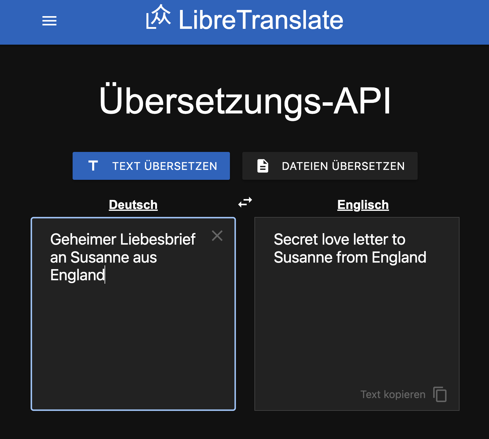

# LibreTranslate Setup für Raspberry Pi 5



## 📁 Projektstruktur

Empfohlene Ordnerstruktur:

```bash
libretranslate-project/
├── docker-compose.yml
└── setup.sh
```

---

## 🛠️ Voraussetzungen

Stelle sicher, dass folgende Software auf dem Raspberry Pi 5 installiert ist:

1. **Docker**
2. **Docker Compose**

### Installation:

```bash
# Docker installieren
curl -sSL https://get.docker.com | sh
sudo usermod -aG docker $USER
newgrp docker

# Docker Compose (v2, direkt integriert)
sudo apt install -y docker-compose-plugin
```

---

## 📄 docker-compose.yml

Speichere folgende Datei unter `libretranslate-project/docker-compose.yml`:

```yaml
services:
  libretranslate:
    image: libretranslate/libretranslate:latest
    ports:
      - "5005:5000"
    environment:
      - LT_LOAD_ONLY=en,de,fr,es
      - LT_CORS_ALLOWED_ORIGINS=*
      - LT_DEBUG=true
    restart: unless-stopped
```

---

## 🛠️ setup.sh

Diese Datei automatisiert das Setup:

```bash
#!/bin/bash

set -e

echo "📦 Starte Setup für LibreTranslate auf Raspberry Pi 5..."

# Sicherstellen, dass Docker läuft
echo "🔧 Starte Docker falls nötig..."
sudo systemctl enable docker
sudo systemctl start docker

# Projektverzeichnis
DIR="$(dirname "$(realpath "$0")")"
cd "$DIR"

# Docker Compose starten
echo "🚀 Starte LibreTranslate mit Docker Compose..."
docker compose up -d

echo "✅ LibreTranslate läuft auf http://localhost:5005"
```

Speichere es als `setup.sh` und mache es ausführbar:

```bash
chmod +x setup.sh
```

Dann ausführen mit:

```bash
./setup.sh
```

---

## ✅ Nach dem Start

LibreTranslate ist jetzt erreichbar unter:

```
http://<raspberrypi-ip>:5005
```

### Beispiel-Test mit curl:

```bash
curl -X POST http://localhost:5005/translate \
     -H 'Content-Type: application/json' \
     -d '{"q": "Hallo Welt", "source": "de", "target": "en"}'
```

---

